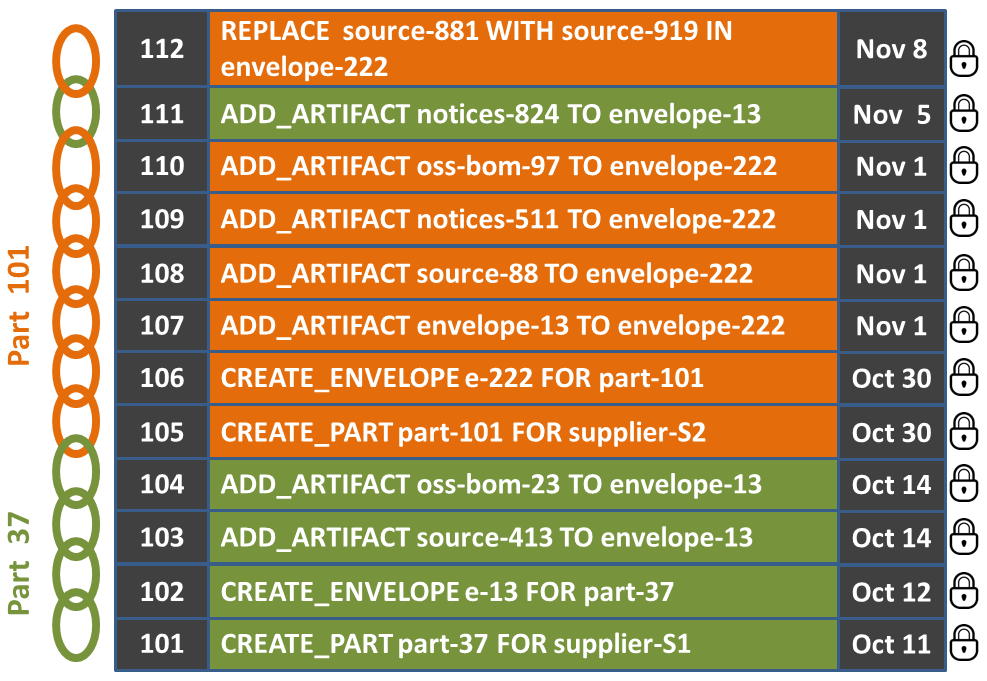
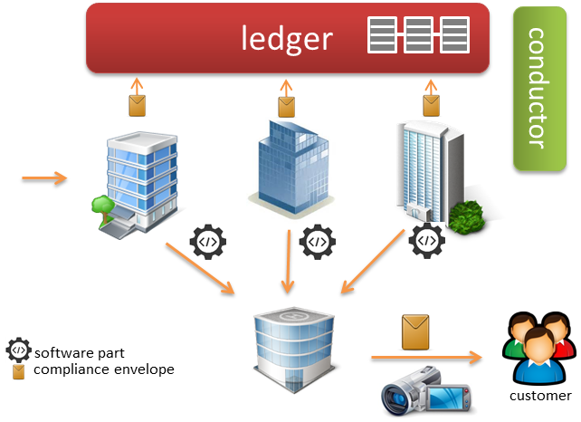

## Utilizing a Blockchain to Establish Trust with Open Source Across the SupplyChain

## Introduction

We developed a Blockchain Ledger to identify and track the open source components from which today's manufactured products are constructed. The ledger establishes trust between a manufacture and its suppliers by tracking suppliers, their software parts, the open source used and the corresponding compliance artifacts (e.g., source code, legal notices, SPDX data, cryptography data). This is particular helpful for most manufactures who build products by utilizing software parts provide by many different suppliers - some of which the manufacture may not be aware of because  they serve as sub-suppliers to other suppliers. To achieve accountability a mechanism is need to maintain global state information about the suppliers, their parts and compliance artifacts  for all  participate across the supply chain. Furthermore to complete the circle of trust these records need to be secure, immutable while removing the dependence on third party information brokers.

We obtain the require level of trust by utilizing the Linux Foundation’s Hyperledger project's Sawtooth Lake platform to construct a Blockchain Ledger. The Ledger obtains accountability by tracking which suppliers delivered which software parts that used which open source and who delivered (or did not deliver) which open source compliance artifacts. We utilize a new data construct, the **Compliance Envelope**, a standard method of collecting, indexing and archiving the compliance artifacts  such that they can be delivered as a single item for a given software part. We use the Ledger to maintain the associate between the supplier, part and the corresponding compliance envelope. The Ledger also ensures the compliance envelope information is secure and immutable and that no central information broker is required. 

The ability to identify each open source component used to construct today's manufacture products is necessary to: 1) identify, review and secure the distribution rights (licenses) for each component; 2) understand the impact of an open source security vulnerability on a given product; 3) enable identification of cryptography technologies (e.g., export licensing); and 4) enable accurate reporting on all open source parts as a requirement to obtain functional safety certification for safety critical products (e.g, medical devices, aircraft, autonomous vehicles, elevators and so forth).

## Example Illustration

The biggest challenge to obtaining a complete Open Source Bill of Materials (OSS-BOM) for manufacture products (along with the corresponding compliance artifacts) arises because software parts are provided by multiple different  suppliers. Consider the simple example illustrated below  where three different suppliers provide software parts for the manufacturing of a video camera V sold by manufacturer M. Supplier S1 delivers the microprocessor accompanied by the firmware and software drivers. Supplier S2 assembles and delivers the Linux runtime operating system and Supplier S3 delivers the applications that manage the camera display, menu and various functions. Ideally, when camera V ships, it should be accompanied by a single compliance envelope that contains, as a minimum, a list of all the open source parts incorporated by the various suppliers (OSS BOMs) and the mandatory source code and legal notices.

  
<b>Figure 1</b>: Video camera V, suppliers, parts, envelopes and open source artifacts

Manufacturer M needs a way to trust that 1) each supplier has prepared the required compliance artifacts for their respective contribution; 2) in the event that an artifact was missing or not properly prepared (e.g., source), we can identify who is responsible for remedying the situation; and 3) no one supplier can sabotage (hack) the integrity of the compliance artifacts of another supplier. We used the Blockchain technology to create a Software Parts Ledger to manage this complexity. It serves as a global data store that tracks the state of suppliers, their list of software parts, the corresponding envelopes and envelope content. Typical transactions performed on the Ledger include adding a part to a supplier’s parts list, assigning an envelope to a software part, and adding, updating and removing artifacts from an envelope.

  
<b>Figure 2</b>: Software Ledger 

Figure 2 illustrates Ledger entries that represent the parts for video camera V presented in Figure 2. Transactions 101 through 104 represent software part 37 and transactions 105 through 110 represent part 101. Transaction 111 illustrates that an additional artifact was later added to the part 37 envelope and transaction 112 illustrates that the source code was updated for part 101’s envelope. In the first instances, Supplier S1 forgot to include a notice artifact but was able to remedy it after the fact. In the second instance, Supplier S2 was able to determine that some of the mandatory/required source code was missing and to efficiently remedy the issue by simply updating the ledger. By recording software part information in the ledger, customers of both suppliers S1 and S2 would automatically receive the updates. Upon shipping video camera V, manufacturer M could query the Ledger to obtain the latest most comprehensive collect of compliance artifacts available. If updates where made V's compliance envelope after it shipped (e.g., missing source code added) then manufacturer M or the Customer would be able to otbain the latest version by referencing the Ledger. 

A more detailed discussion of the the use and benefits of a Software Ledger to track and manage the use of open source across the supply chain can be found here:
   [\[article\]](https://github.com/MarkGisi/articles-n-insights/blob/master/open-source/SoftwareLedger4SupplyChain.pdf)

## Project Components

A supply chain network has two core system components: the ledger and conductor. The **ledger**, built using the Hyperledger Project's Sawtooth platform,  tracks:

- **suppliers** - providers of software parts. Each supplier needs to have a ledger registration. 
- **software parts** - software parts used by manufactures to constructor their products. both simple and complex software parts. 
- **compliance artifacts** - artifacts prepared to satisfy the license obligations for the different opens source components used used to create a software part. They typically include obligatory source code, written offers for source, license notices and/or copies of licenses. The collection could also include information that, although not required by a license, provides important utility, such as Open Source BOMs, SPDX licensing data and cryptography information.
- **compliance envelope** - a construct that represents a standard method of indexing, bundling and delivering the compliance artifacts as a single item. Regardless of whether a software offering is a simple atomic part (e.g., software library), or a more complex one such as the software runtime that controls a consumer device, the envelope contains a rich collection of information that represents all the open source parts that the offering was comprised of.
- **relationships** -  relationships between the above entities (e.g, supplier -> parts, part -> envelope, ...)

The ledger is accessible via a RESTful API, and python and go libraries. 

The **conductor** functions as the network's underlying kernel responsible for monitoring and coordinating the the different supply chain network resources and entities (ledger, applications, suppliers, ...). For instance it maintains a directory of all the network suppliers, applications and ledger nodes. It serves up unique identifiers (UUID) for the various entities (e.g., suppliers, software parts, compliance envelopes, ...)  along with other supply chain network support services. The Conductor is accessible via a RESTful API. 

  
<b>Figure 3</b>: Supply Chain Network with core components: the ledger and conductor.

Figure 3 illustrates the relations between the suppliers, manufacture, software parts, compliance artifacts and customers. Suppliers register their software parts and compliance envelopes. 

The ledger provides the ability to maintain global state information across the supply chain network. This information established trust between suppliers and manufactures by holding suppliers accountable for their the open source compliance artifacts that accompany the software part delivery.

## Getting Started

See the Getting Start document in the project's documentation directory (/doc).
